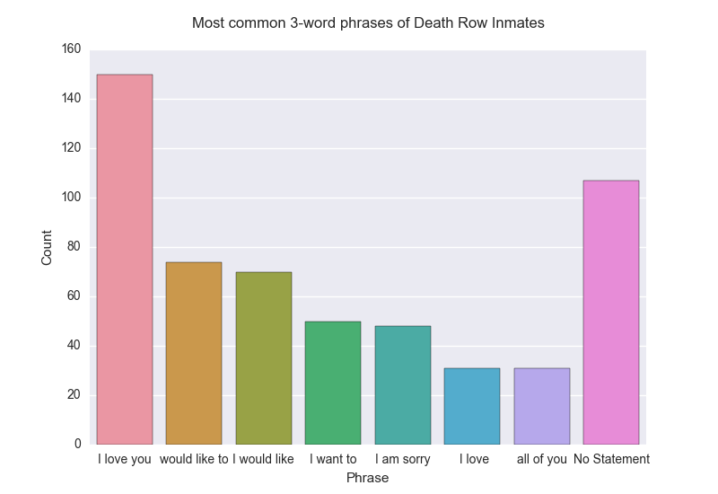

# Death Row Inmate Visualizations

This repo is for a 2-hour sprint by Jamen Long, Tim Bearden, and Michael Julian. We scouted a dataset, scraped it, made some visuals.

We scraped last statements from death row inmates, provided by the State of Texas:

http://www.tdcj.state.tx.us/death_row/dr_executed_offenders.html

## Deaths Across Time

## Deaths by Background

## Most Common Trigrams

